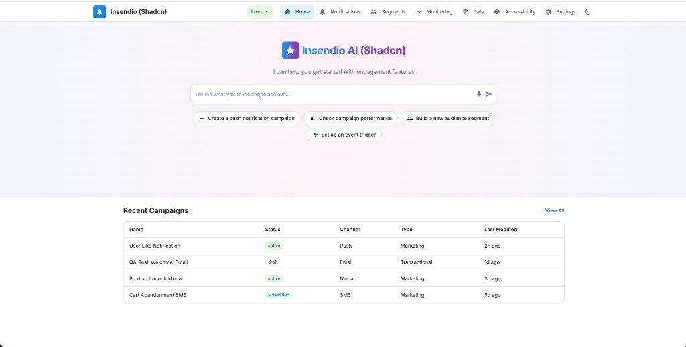
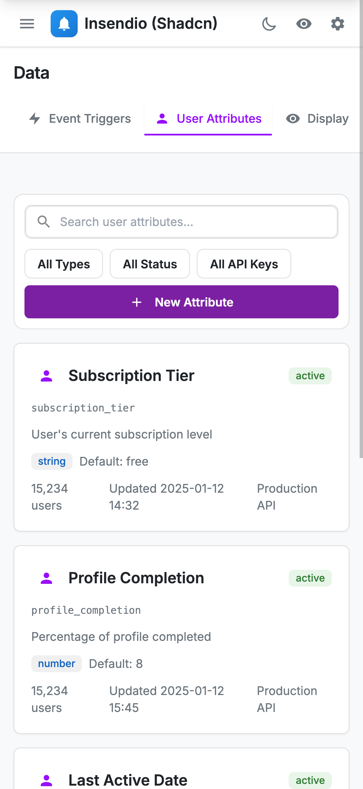

# Insendio App

The insendio-app is a demo application that showcases the design system with different component libraries. It uses a **polymorphic component** pattern and **specialization** for reusable, library-agnostic UI.

## Screenshots

**Home page** – AI assistant, suggested actions, and recent campaigns table:



**Data page** – User Attributes with search, filters, and attribute cards:



## Component Context

insendio-app does not import components from mui, daisyui, etc. Instead, it receives them via React Context:

```tsx
// packages/insendio-app/src/components-context.tsx
export interface InsendioComponents {
  library?: string;   // e.g. "MUI", "DaisyUI"
  Box: React.ComponentType<any>;
  Stack: React.ComponentType<any>;
  Button: React.ComponentType<any>;
  Dialog: React.ComponentType<any>;
  AlertDialog: React.ComponentType<any>;
  // ... all primitives
}

const InsendioComponentsContext = React.createContext<InsendioComponents | null>(null);
export function useInsendioComponents() { ... }
export const InsendioComponentsProvider = InsendioComponentsContext.Provider;
```

Each app provides the components:

```tsx
// apps/mui-app/App.tsx
const muiComponents: InsendioComponents = {
  library: 'MUI',
  Box, Stack, Button, Input, ...
};

<InsendioComponentsProvider value={muiComponents}>
  <InsendioApp />
</InsendioComponentsProvider>
```

## Specialization Pattern

Specialization is a React composition pattern: a **specialized** component wraps a **generic** one and passes down specific props or layout.

### Specialized Components

| Component | Wraps | Purpose |
|-----------|-------|---------|
| `PageLayout` | Stack | Page container with title |
| `InsendioTab` | Tab | Insendio tab styling (purple/sky/blue themes) |
| `InsendioTabList` | TabList | Standard tab list styling |
| `InsendioCard` | Box | Card styling (default/surface variants) |
| `InsendioPrimaryButton` | Button | Purple CTA button |
| `InsendioStatCard` | Box | Stat display (icon + label + value) |
| `InsendioNavLink` | NavLink | Sidebar nav styling |
| `InsendioAlert` | Alert | Info/success alert styling |
| `InsendioInfoAlert` | InsendioAlert | Info alert with icon |
| `InsendioTable` | Table | Table with Insendio styling |
| `InsendioTableToolbar` | Box | Table toolbar (filters, actions) |
| `InsendioList` / `InsendioListItem` | Box | List layout components |
| `InsendioRateLimitCard` | Box | Rate limit display card |

Charts (from `@design-system/charts`) are used on the **Dashboard** page (`/dashboard`) for Bar, Line, Pie, Area, and Network graph visualizations.

### Example: InsendioCard

```tsx
// Generic usage (repeated in every page)
<Box className="rounded-xl border border-[var(--ds-border-default)] bg-white shadow-sm">
  {content}
</Box>

// Specialized usage
<InsendioCard>{content}</InsendioCard>
```

InsendioCard wraps the generic Box from context and injects the standard card classes.

### Containment

Specialized components use `{children}` to fill the generic container:

```tsx
export function InsendioCard({ children, variant = 'default' }: InsendioCardProps) {
  const { Box } = useInsendioComponents();
  return (
    <Box className={cn('rounded-xl border ...', variant === 'surface' && 'bg-[var(--ds-bg-surface)]')}>
      {children}
    </Box>
  );
}
```

## App Structure

```
insendio-app/
├── src/
│   ├── InsendioApp.tsx       # Routes, lazy-loaded pages
│   ├── components-context.tsx
│   ├── theme-context.tsx
│   ├── accessibility-context.tsx
│   ├── mock-data.ts
│   ├── components/
│   │   ├── InsendioLayout.tsx
│   │   └── insendio/         # Specialized components
│   │       ├── PageLayout.tsx
│   │       ├── InsendioTab.tsx
│   │       ├── InsendioCard.tsx
│   │       ├── InsendioAlert.tsx
│   │       ├── InsendioTable.tsx
│   │       ├── InsendioTableToolbar.tsx
│   │       ├── InsendioList.tsx
│   │       ├── InsendioRateLimitCard.tsx
│   │       └── ...
│   └── pages/
│       ├── HomePage.tsx
│       ├── NotificationsPage.tsx
│       ├── SegmentsPage.tsx
│       ├── MonitoringPage.tsx
│       ├── DataPage.tsx
│       ├── RolesPage.tsx      # Settings: Team Members, Manage Roles
│       ├── AccessibilityPage.tsx
│       ├── DashboardPage.tsx
│       └── ...
```

## Pages & Routes

| Route | Page | Description |
|-------|------|-------------|
| `/` | HomePage | AI assistant, suggested actions, recent campaigns |
| `/notifications` | NotificationsPage | Notification management |
| `/segments` | SegmentsPage | User segments with edit/delete dialogs |
| `/monitoring` | MonitoringPage | Campaign monitoring |
| `/data` | DataPage | User attributes, deeplinks |
| `/roles` | RolesPage | Settings: Team Members tab (edit/delete), Manage Roles (permissions matrix) |
| `/accessibility` | AccessibilityPage | Accessibility preferences (reduce motion, high contrast, etc.) |
| `/dashboard` | DashboardPage | Analytics: Overview, User Behavior, Performance, Flows tabs with charts |

**Dialogs:** Segments and Team Members use `Dialog` for edit forms and `AlertDialog` for delete confirmation.

## Library Title

The `library` field in the context is shown in the UI:

- Sidebar: "Insendio (MUI)" or "Insendio (DaisyUI)"
- Home hero: "Insendio AI (MUI)"

When `library` is not provided, the suffix is omitted.

## Running the App

```bash
pnpm dev:styled-base    # Styled base (recommended)
pnpm dev:shadcn-radix   # Shadcn Radix (Radix + Tailwind)
pnpm dev:shadcn-ui      # Shadcn UI (copied components)
pnpm dev:daisyui        # DaisyUI components
pnpm dev:hero-ui        # Hero UI components
pnpm dev:mui            # MUI components
```

Each command runs the same Insendio app with a different component library injected via context. Use `pnpm dev:docs` for the docs app; `pnpm start:prod` runs all apps + Caddy at http://localhost:8080/.
